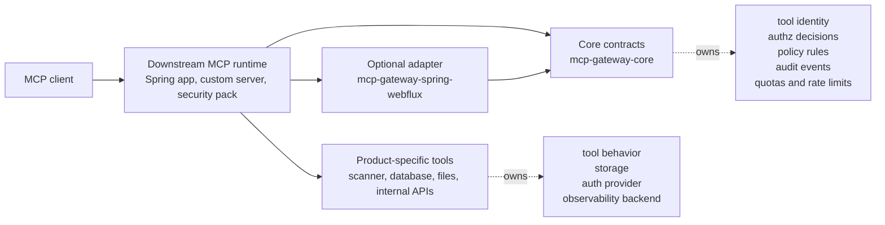

# MCP Gateway Core

[](https://central.sonatype.com/artifact/io.github.dtkmn/mcp-gateway-core)
[](https://central.sonatype.com/artifact/io.github.dtkmn/mcp-gateway-spring-webflux)
[](#build)

Java governance contracts and primitives for MCP tool gateways.

This repository is intentionally small. It provides MCP-neutral Java value
types and helpers that downstream gateway runtimes can use for tool identity,
authorization, policy decisions, audit events, abuse protection, URL scoping,
correlation IDs, and rate limiting. It also publishes an optional Spring WebFlux
adapter for Java runtimes that want ready-made HTTP filters around those core
contracts.

It is not a gateway runtime, router, scanner integration, UI, service mesh, or
traffic-management data plane.

Current status: public preview. The package and coordinate are intended for
early integration proof, not a stable compatibility promise.

## Architecture At A Glance



## Why This Exists

MCP servers need a reusable governance layer around tool calls: identify the
tool, decide whether the caller may invoke it, apply quotas and rate limits,
record audit events, and keep product-specific integrations out of the shared
contract.

`mcp-gateway-core` is that contract layer. `mcp-gateway-spring-webflux` is a
thin framework adapter over the same contracts. Downstream projects still own
their transport setup, authentication provider, storage, observability backend,
and domain-specific tool behavior.

## Relationship To Runtime Gateways

Runtime gateway projects such as
[agentgateway](https://agentgateway.dev/docs/standalone/main/about/introduction/)
provide a gateway control plane and proxy/data plane for routing, securing, and
observing MCP, LLM, A2A, and other agent traffic.

`mcp-gateway-core` is deliberately narrower. It is a Java library for reusable
MCP tool-governance contracts: tool descriptors, authorization requirements,
policy decisions, audit events, abuse-protection decisions, and small helper
primitives.

Use a runtime gateway when you need traffic routing, proxying, Kubernetes
Gateway API integration, backend federation, or data-plane operations. Use
`mcp-gateway-core` when you are building an MCP gateway/security pack and need
a shared Java contract for tool-level governance without adopting a full proxy
runtime.

## Scope

Included:

- MCP tool invocation contracts
- MCP tool identity, surface, capability, and access-registry contracts
- MCP tool authorization request, requirement, registry, authorizer, and evaluator contracts
- policy decision and policy-bundle evaluation contracts
- audit event, sink, and emitter contracts
- abuse-protection context and quota decision contracts
- correlation ID helpers
- URL-scope helpers
- token-bucket rate limiting primitives
- gateway execution context and principal/workspace model
- optional Spring WebFlux request filters and JSON-RPC parsing adapters

Excluded:

- scanner integrations
- report, finding, queue, or evidence storage
- Spring Boot application wiring or auto-configuration
- enterprise packaging
- A2A, LLM-provider, service-mesh, or Kubernetes gateway implementation
- product-specific tool names from downstream security packs

For package-by-package detail, see the [module map](docs/MODULES.md).

For practical integration examples, see the
[getting started guide](docs/GETTING_STARTED.md).

## Module Map

| Area | Package |
| --- | --- |
| MCP invocation | `mcp.gateway.core.invocation` |
| Tool descriptors and registry | `mcp.gateway.core.tool` |
| Execution context | `mcp.gateway.core.context` |
| Authorization | `mcp.gateway.core.authz` |
| Policy decisions | `mcp.gateway.core.policy` |
| Policy bundle evaluation | `mcp.gateway.core.policybundle` |
| Audit events | `mcp.gateway.core.audit` |
| Abuse protection and quota decisions | `mcp.gateway.core.protection` |
| Rate limiting | `mcp.gateway.core.rate` |
| Correlation IDs | `mcp.gateway.core.logging` |
| URL scope checks | `mcp.gateway.core.url` |
| Spring WebFlux adapter | `mcp.gateway.spring.webflux` |

The core artifact remains JDK-only. The Spring WebFlux adapter is separate so
runtime projects can choose it without forcing Spring onto core consumers.
Storage, scanner, and product behavior stay outside both artifacts.

## Repository Layout

```text
core/                       # publishes io.github.dtkmn:mcp-gateway-core
adapters/spring-webflux/    # publishes io.github.dtkmn:mcp-gateway-spring-webflux
```

The root Gradle project only coordinates shared verification tasks. It is not a
published artifact.

## Build

```bash
./gradlew verifyGatewayPublicPreviewPublication --no-daemon --stacktrace
```

This command runs the core and adapter builds, forbidden-coupling checks,
closed-world JAR checks, Java 17 bytecode checks, adapter runtime-classpath
bytecode checks, core `jdeps`, unsigned Central Portal bundle validation, and
signed dry-run bundle validation with an ephemeral local GPG key.

## Coordinates

Core coordinate:

```text
io.github.dtkmn:mcp-gateway-core:0.5.9
```

Optional Spring WebFlux adapter coordinate:

```text
io.github.dtkmn:mcp-gateway-spring-webflux:0.5.9
```

Gradle:

```groovy
implementation "io.github.dtkmn:mcp-gateway-core:0.5.9"
implementation "io.github.dtkmn:mcp-gateway-spring-webflux:0.5.9" // optional
```

Maven:

```xml
<dependency>
  <groupId>io.github.dtkmn</groupId>
  <artifactId>mcp-gateway-core</artifactId>
  <version>0.5.9</version>
</dependency>
<dependency>
  <groupId>io.github.dtkmn</groupId>
  <artifactId>mcp-gateway-spring-webflux</artifactId>
  <version>0.5.9</version>
</dependency>
```

## Local Staging

```bash
./gradlew :core:publishGatewayCorePublicationToGatewayCoreStagingRepository \
  :adapters:spring-webflux:publishGatewaySpringWebFluxPublicationToGatewayCoreStagingRepository \
  -PgatewayCorePublicationRepositoryUrl="$(pwd)/build/staging-repository" \
  --no-daemon --stacktrace
```

## Release And Compatibility

- [Getting started](docs/GETTING_STARTED.md)
- [Release policy](docs/RELEASE_POLICY.md)
- [Compatibility policy](docs/COMPATIBILITY.md)
- [Central validation upload](docs/CENTRAL_VALIDATION_UPLOAD.md)
- [Module map](docs/MODULES.md)
- [Roadmap](docs/ROADMAP.md)
- [Security policy](SECURITY.md)

## Security Tooling

The repository uses GitHub-native security automation first:

- Dependabot version updates for GitHub Actions and Gradle.
- CodeQL Java analysis with an explicit Gradle test build.
- Snyk Open Source scanning for the Gradle project graph in
  `.github/workflows/snyk.yml`. The workflow requires a real `SNYK_TOKEN`
  secret, accepts optional `SNYK_ORG` as a secret or variable for explicit
  organization routing, fails visibly when the token is absent, uploads SARIF
  for review, and then enforces the Snyk exit code.
- The Gradle public-preview verification gate for forbidden coupling,
  closed-world JAR contents, `jdeps`, Central bundle shape, checksums, and
  signed dry-run payload validation.

The Snyk workflow is external dependency scanning. It does not publish,
promote, or change the manual public-preview release path.

## Future Plan

The short version: prove boring governance contracts through real downstream
consumers before claiming stable API or broader gateway-runtime scope.

See the [roadmap](docs/ROADMAP.md) for graduation criteria and non-goals.
