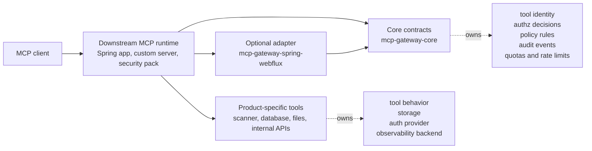

# MCP Gateway Core

[](https://central.sonatype.com/artifact/io.github.dtkmn/mcp-gateway-core)
[](https://central.sonatype.com/artifact/io.github.dtkmn/mcp-gateway-spring-webflux)
[](#build)

Java governance contracts and primitives for MCP tool gateways.

This repository is intentionally small. It provides MCP-neutral Java value
types and helpers that downstream gateway runtimes can use for tool identity,
authorization, policy decisions, audit events, abuse protection, URL scoping,
correlation IDs, and rate limiting. It also publishes an optional Spring WebFlux
adapter for Java runtimes that want ready-made HTTP filters around those core
contracts.

It is not a gateway runtime, router, scanner integration, UI, service mesh, or
traffic-management data plane.

Current status: public preview. The latest published version is `0.9.0`. The
package and coordinates are intended for early integration proof, not a stable
compatibility promise.

## Positioning

`mcp-gateway-core` is an embeddable Java governance contract library for MCP
tool runtimes. It gives runtimes a shared vocabulary for tool identity, access
rules, governance decisions, audit events, abuse-protection decisions, rate
limits, correlation IDs, URL scope checks, and adapter-facing primitives.

It is not an MCP server SDK, Spring Boot starter, OAuth provider, policy
language, scanner layer, plugin system, proxy, or data plane. Those systems may
use these contracts, but they should keep their runtime, product, storage, and
transport behavior outside this library.

## Architecture At A Glance


```mermaid
flowchart LR
    Client["MCP client"]
    Runtime["Downstream MCP runtime<br/>Spring app, custom server, security pack"]
    Adapter["Optional adapter<br/>mcp-gateway-spring-webflux"]
    Core["Core contracts<br/>mcp-gateway-core"]
    Product["Product-specific tools<br/>scanner, database, files, internal APIs"]

    Client --> Runtime
    Runtime --> Adapter
    Runtime --> Core
    Adapter --> Core
    Runtime --> Product

    Core -. owns .-> Contracts["tool identity<br/>authz decisions<br/>policy rules<br/>audit events<br/>quotas and rate limits"]
    Product -. owns .-> Behavior["tool behavior<br/>storage<br/>auth provider<br/>observability backend"]
```

## Why This Exists

MCP servers need a reusable governance layer around tool calls: identify the
tool, decide whether the caller may invoke it, apply quotas and rate limits,
record audit events, and keep product-specific integrations out of the shared
contract.

`mcp-gateway-core` is that contract layer. `mcp-gateway-spring-webflux` is a
thin framework adapter over the same contracts. Downstream projects still own
their transport setup, authentication provider, storage, observability backend,
and domain-specific tool behavior.

## Relationship To Runtime Gateways

Runtime gateway projects such as
[agentgateway](https://agentgateway.dev/docs/standalone/main/about/introduction/)
provide a gateway control plane and proxy/data plane for routing, securing, and
observing MCP, LLM, A2A, and other agent traffic.

`mcp-gateway-core` is deliberately narrower. It is a Java library for reusable
MCP tool-governance contracts: tool descriptors, authorization requirements,
policy decisions, audit events, abuse-protection decisions, and small helper
primitives.

Use a runtime gateway when you need traffic routing, proxying, Kubernetes
Gateway API integration, backend federation, or data-plane operations. Use
`mcp-gateway-core` when you are building an MCP gateway/security pack and need
a shared Java contract for tool-level governance without adopting a full proxy
runtime.

## Scope

Included:

- MCP tool invocation contracts
- MCP tool identity, surface, capability, and access-registry contracts
- MCP tool authorization request, requirement, registry, authorizer, and evaluator contracts
- policy decision and policy-bundle evaluation contracts
- audit event, sink, and emitter contracts
- abuse-protection context and quota decision contracts
- framework-neutral gateway governance orchestration
- correlation ID helpers
- URL-scope helpers
- token-bucket rate limiting primitives
- gateway execution context and principal/workspace model
- optional Spring WebFlux governance filter and JSON-RPC parsing adapters

The Spring WebFlux adapter fails closed on invalid MCP JSON-RPC message shapes
when authorization, abuse protection, or an optional tool registry keeps
filtering active. The unreleased `toolRegistry(McpToolRegistry)` builder option
checks the runtime's registered, enabled tools before permissions: unknown and disabled
tools receive the same MCP error without exposing permission details. Hosting
runtimes supply the existing core registry populated with exactly their active
tools, including through an active-only `McpToolAccessRegistry.toolRegistry()`;
no separate tool list is required. Upgrading the adapter alone does not enable
this behavior. The adapter recognizes response-shaped envelopes used by clients
to answer server-initiated requests and passes them downstream without request
governance. When both authorization and abuse protection are inactive and no
registry is configured, it preserves exact downstream pass-through, including
JSON-RPC batch bodies.
See the [contract reference](docs/CONTRACT_REFERENCE.md) for the full wire
contract.

Excluded:

- MCP server SDK behavior
- scanner integrations
- report, finding, queue, or evidence storage
- OAuth provider or auth-server behavior
- Spring Boot application wiring or auto-configuration
- enterprise packaging
- A2A, LLM-provider, service-mesh, or Kubernetes gateway implementation
- policy-language runtime
- plugin loading
- product-specific tool names from downstream security packs

For package-by-package detail, see the [module map](docs/MODULES.md).

For practical integration examples, see the
[getting started guide](docs/GETTING_STARTED.md).
For field and value semantics, see the
[contract reference](docs/CONTRACT_REFERENCE.md).

## Module Map

| Area | Package |
| --- | --- |
| MCP invocation | `mcp.gateway.core.invocation` |
| Tool descriptors and registry | `mcp.gateway.core.tool` |
| Execution context | `mcp.gateway.core.context` |
| Authorization | `mcp.gateway.core.authz` |
| Policy decisions | `mcp.gateway.core.policy` |
| Policy bundle evaluation | `mcp.gateway.core.policybundle` |
| Audit events | `mcp.gateway.core.audit` |
| Abuse protection and quota decisions | `mcp.gateway.core.protection` |
| Governance orchestration | `mcp.gateway.core.governance` |
| Rate limiting | `mcp.gateway.core.rate` |
| Correlation IDs | `mcp.gateway.core.logging` |
| URL scope checks | `mcp.gateway.core.url` |
| Spring WebFlux adapter | `mcp.gateway.spring.webflux` |

The core artifact remains JDK-only. The Spring WebFlux adapter is separate so
runtime projects can choose it without forcing Spring onto core consumers.
Storage, scanner, and product behavior stay outside both artifacts.

## Repository Layout

```text
core/                       # publishes io.github.dtkmn:mcp-gateway-core
adapters/spring-webflux/    # publishes io.github.dtkmn:mcp-gateway-spring-webflux
```

The root Gradle project only coordinates shared verification tasks. It is not a
published artifact.

## Build

Building from source requires JDK 25. Published libraries support Java 17 and
later; the external consumer smoke test runs separately with JDK 17. Use the
checked-in Gradle Wrapper; no system Gradle installation is needed.

```bash
./gradlew verifyGatewayDevelopment --no-daemon --stacktrace --warning-mode fail
```

This gate runs tests, JAR class ownership checks, core `jdeps`, and Java 17
compatibility checks for adapter runtime dependencies. Compilation targets Java
17 with `--release 17`. The command also fails on Gradle deprecations and stages
both Maven publications for the downstream-consumer smoke test.

JAR checks require classes in each module's package and reject classes outside
that package. Normal resources, such as license files and service descriptors,
are allowed.

Development and release preparation use this same gate. Release preparation
sets an unpublished, non-snapshot version. The
[Central validation upload workflow](docs/CENTRAL_VALIDATION_UPLOAD.md) signs
release artifacts with the configured key and verifies their signatures and
checksums from the final combined bundle before any upload.

CI and release preparation also run the Java 17 consumer smoke test against the
staged artifacts:

```bash
./bin/java17-consumer-smoke.sh
```

The smoke script uses separate clean external consumers for core-only and
Spring WebFlux scenarios, resolves `io.github.dtkmn` artifacts only from the
staged repository, and exercises the current WebFlux filter path.

## Coordinates

These are the current published `0.9.0` public-preview coordinates.

Core coordinate:

```text
io.github.dtkmn:mcp-gateway-core:0.9.0
```

Optional Spring WebFlux adapter coordinate:

```text
io.github.dtkmn:mcp-gateway-spring-webflux:0.9.0
```

Gradle:

```groovy
implementation "io.github.dtkmn:mcp-gateway-core:0.9.0"
implementation "io.github.dtkmn:mcp-gateway-spring-webflux:0.9.0" // optional
```

Maven:

```xml
<dependency>
  <groupId>io.github.dtkmn</groupId>
  <artifactId>mcp-gateway-core</artifactId>
  <version>0.9.0</version>
</dependency>
<dependency>
  <groupId>io.github.dtkmn</groupId>
  <artifactId>mcp-gateway-spring-webflux</artifactId>
  <version>0.9.0</version>
</dependency>
```

## Local Staging

```bash
./gradlew :core:publishGatewayCorePublicationToGatewayCoreStagingRepository \
  :adapters:spring-webflux:publishGatewaySpringWebFluxPublicationToGatewayCoreStagingRepository \
  -PgatewayCorePublicationRepositoryUrl="$(pwd)/build/staging-repository" \
  --no-daemon --stacktrace
```

## Release And Compatibility

- [Documentation site](https://danieltse.org/mcp-gateway-core/)
- [Getting started](docs/GETTING_STARTED.md)
- [Contract reference](docs/CONTRACT_REFERENCE.md)
- [Release policy](docs/RELEASE_POLICY.md)
- [Release notes](docs/RELEASE_NOTES.md)
- [Compatibility policy](docs/COMPATIBILITY.md)
- [Central validation upload](docs/CENTRAL_VALIDATION_UPLOAD.md)
- [Module map](docs/MODULES.md)
- [Roadmap](docs/ROADMAP.md)
- [Security policy](SECURITY.md)

## Contributing

See [CONTRIBUTING.md](CONTRIBUTING.md) for local setup, tests, documentation
changes, and pull requests. Bug reports should include the artifact version and
a small reproduction. Report vulnerabilities through the
[security policy](SECURITY.md).

## License

Licensed under the [Apache License 2.0](LICENSE). Binary, sources, and Javadoc
JARs include the license at `META-INF/LICENSE`.

## Security Tooling

The repository uses GitHub-native security automation first:

- Dependabot version updates for GitHub Actions, Gradle, and npm.
- Checked-in third-party GitHub Actions and reusable workflows use reviewed
  full-length commit SHAs, and repository settings require full-SHA references.
- Gradle distribution checksum pinning and Wrapper JAR validation before CI
  workflows execute the build.
- CodeQL Java analysis with an explicit Gradle test build.
- Snyk Open Source scanning for the Gradle project graph in
  `.github/workflows/snyk.yml`. The workflow requires a real `SNYK_TOKEN`
  secret, accepts optional `SNYK_ORG` as a secret or variable for explicit
  organization routing, and uploads SARIF for review. A separate
  `Snyk vulnerabilities` commit status fails when findings exist; the workflow fails
  on scanner or upload errors. Fork pull requests skip this secret-dependent
  job; enabled runs fail visibly when the token is absent.
- The Gradle development gate for JAR class ownership, core `jdeps`, and Java
  17 compatibility checks for adapter runtime dependencies, followed by clean
  Java 17 consumer smoke tests against the staged publications.
- The Central upload workflow verifies artifact signatures, the configured
  signer fingerprint, and checksums from the final combined bundle before upload.
- The Central upload job is bound to a protected environment. Release refs are
  restricted to `main` only; at least one reviewer distinct from the run
  initiator is required; self-review is prevented; administrator bypass is
  disabled; and Central Portal and GPG release credentials exist only as
  environment secrets.

The Snyk workflow is external dependency scanning. It does not publish,
promote, or change the manual public-preview release path.

## Documentation Site

The public documentation site is built with Astro Starlight from `docs-site/`
and deployed to GitHub Pages:

```bash
npm --prefix docs-site run build
```

The site syncs source Markdown from `docs/` and `SECURITY.md` before each build
so the repository README/docs remain the editing source of truth.

## Future Plan

The short version: prove boring governance contracts through real downstream
consumers before claiming stable API or broader gateway-runtime scope.

See the [roadmap](docs/ROADMAP.md) for graduation criteria and non-goals.
